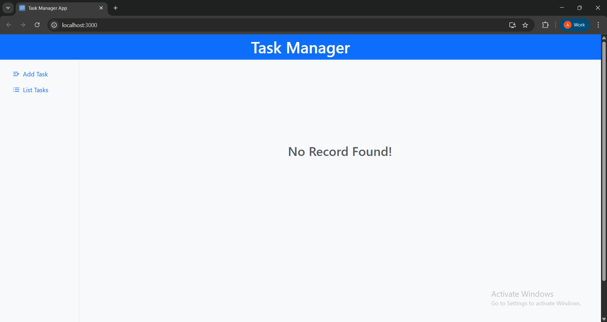
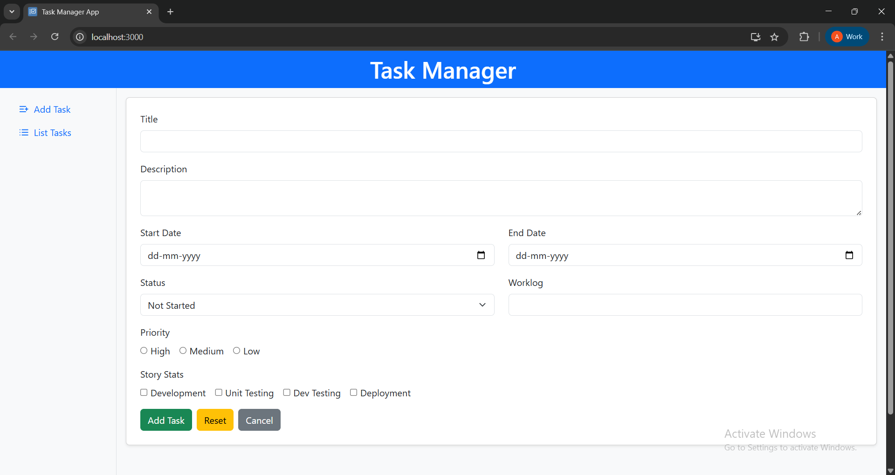
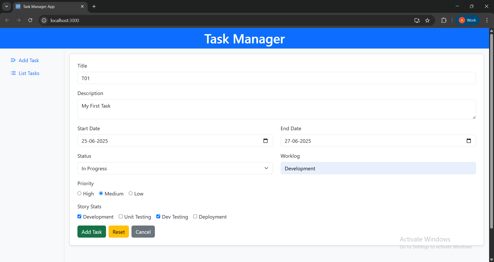
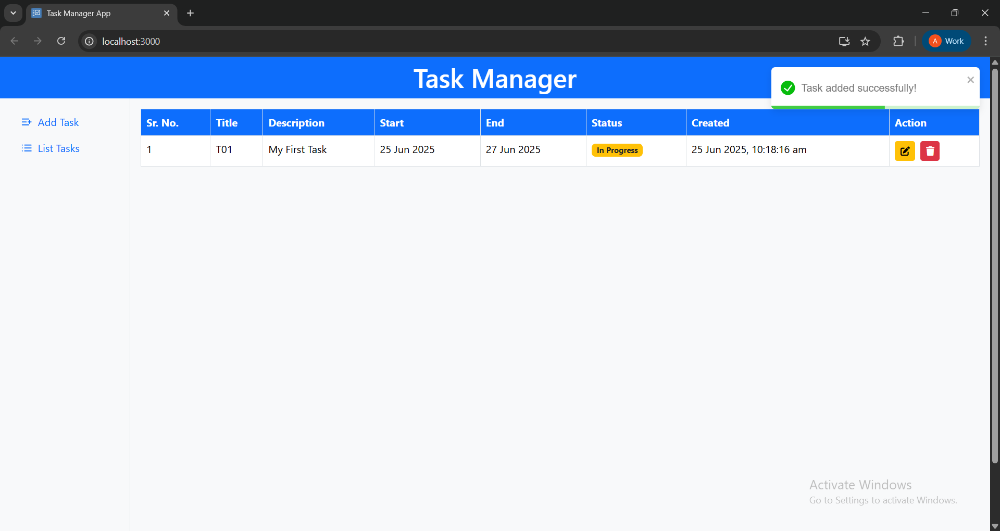
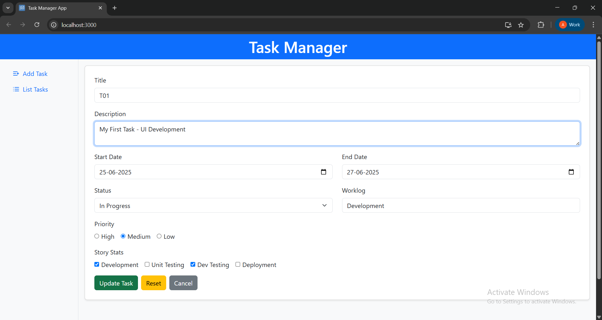
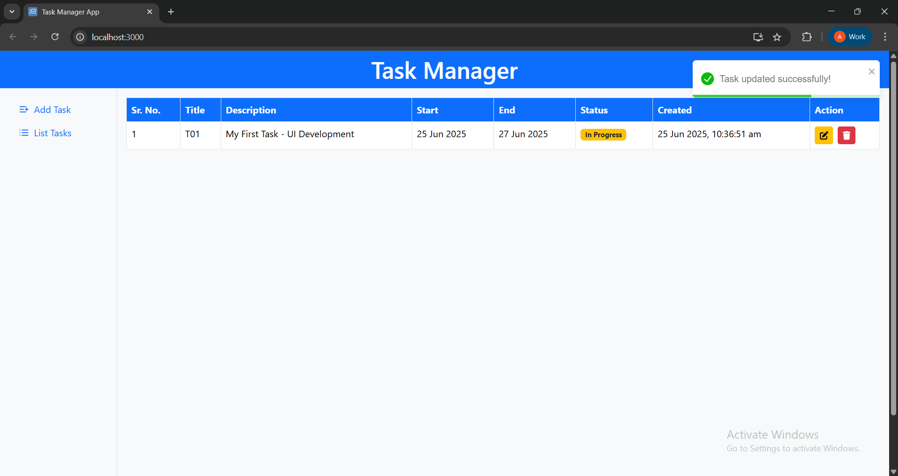
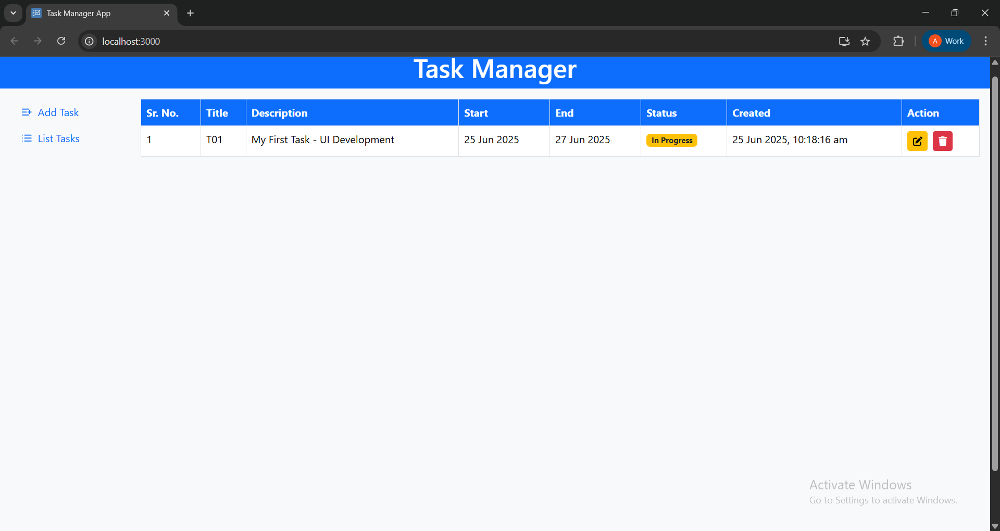
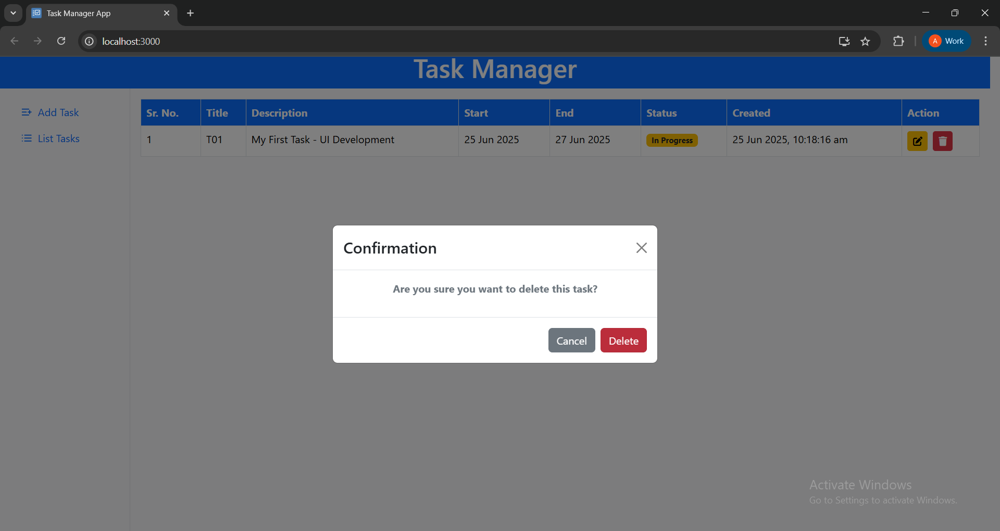
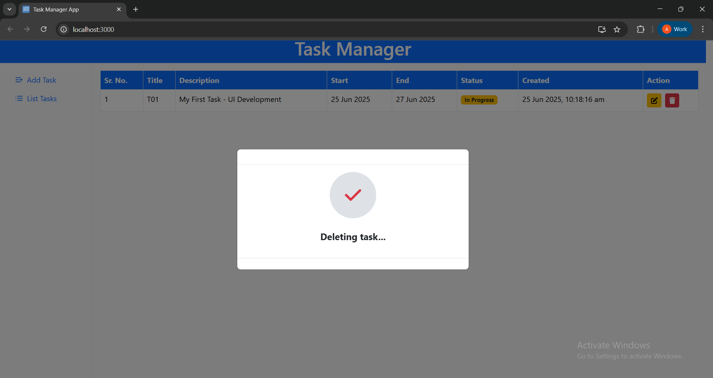

# Task_Manager_App_UI

## Overview

**Task_Manager_App_UI** is a simple and interactive task management application built using **React** and **TypeScript**. It performs full **CRUD operations** (Create, Read, Update, Delete) completely on the **frontend without a backend**, utilizing the browser’s **localStorage** to persist task data. Users can add, edit, reset, and delete tasks through a smooth and intuitive interface.

## Features

- **Add Task**: Create detailed tasks including title, description, dates, status, priority, and worklog.
- **Edit Task**: Easily update any task using the edit feature.
- **Reset Task Form**: Quickly clear all form fields to start fresh.
- **Delete Task**: Remove tasks with a confirmation modal to avoid accidental deletion.
- **Task List View**: See all your tasks in a neatly organized table.
- **Toast Notifications**: Instant feedback for actions like add, update, and delete.
- **Form Validation**: Real-time field validation with asterisk indicators for required or incorrect inputs.
- **No Backend Required**: All data is saved locally using `localStorage`.
- **Responsive UI**: Optimized layout with a side menu and colored status indicators.

## Technologies Used

- **React**
- **TypeScript**
- **HTML**
- **CSS**

## Screenshots

###  Home Screens
#### List Task Page
  
#### Add Task Page
  
---

### Add Task

  
  
---

### Update Task

  
  
---

### Task List

  
 
---

### Delete Task

  
  
 
---

